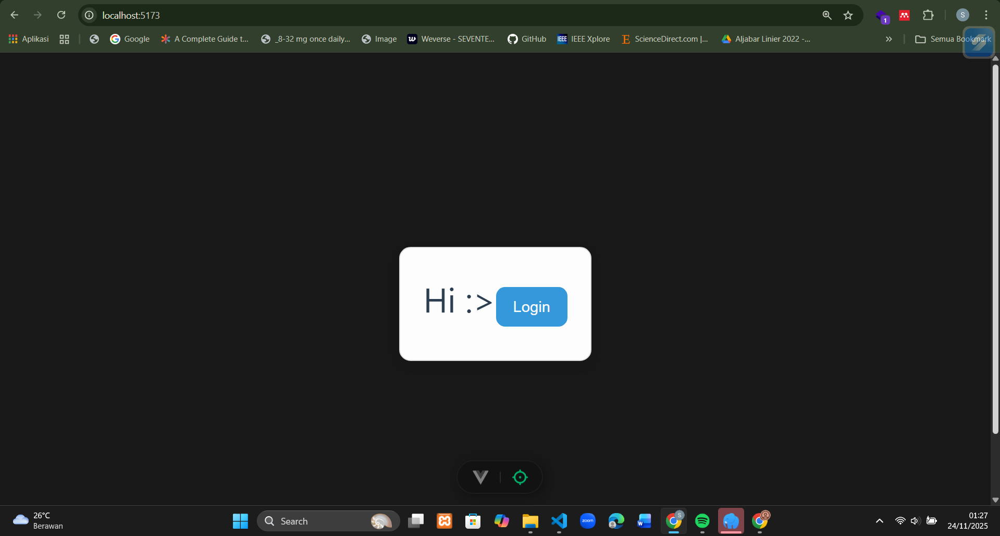
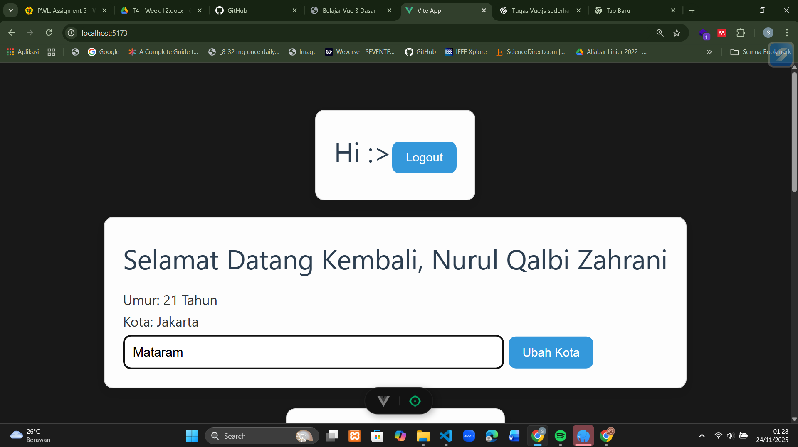
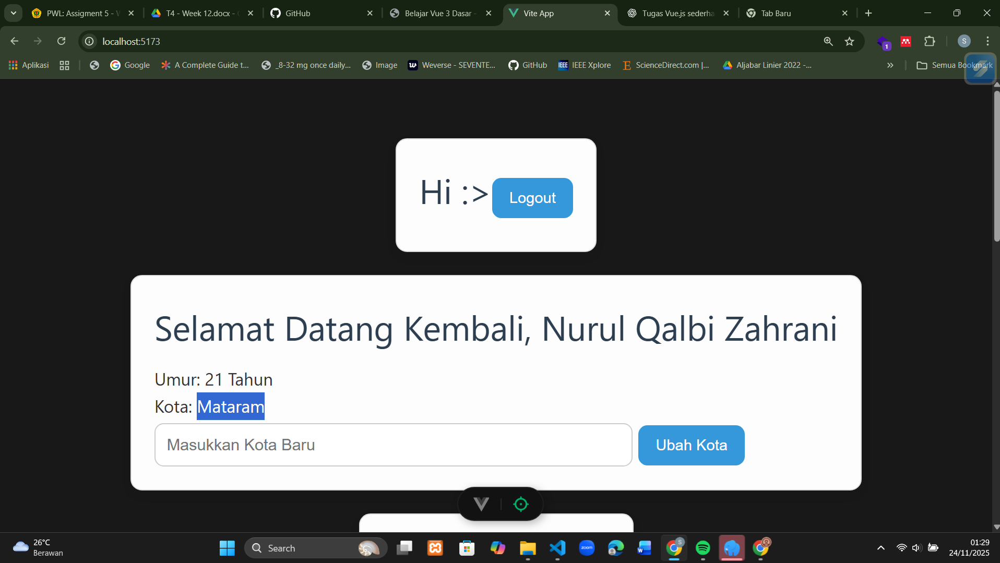
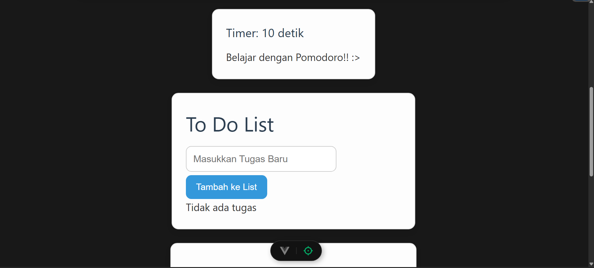
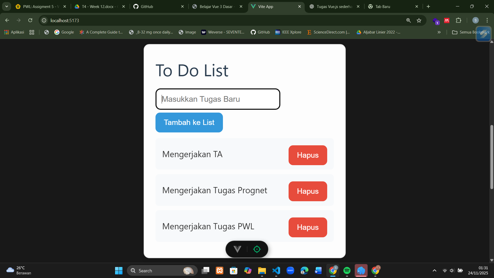
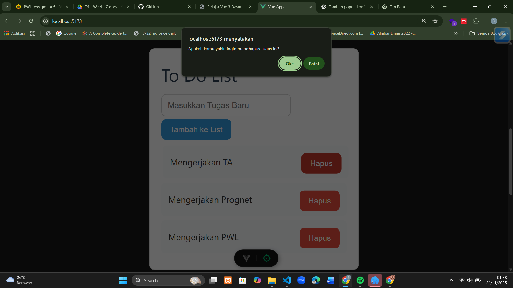
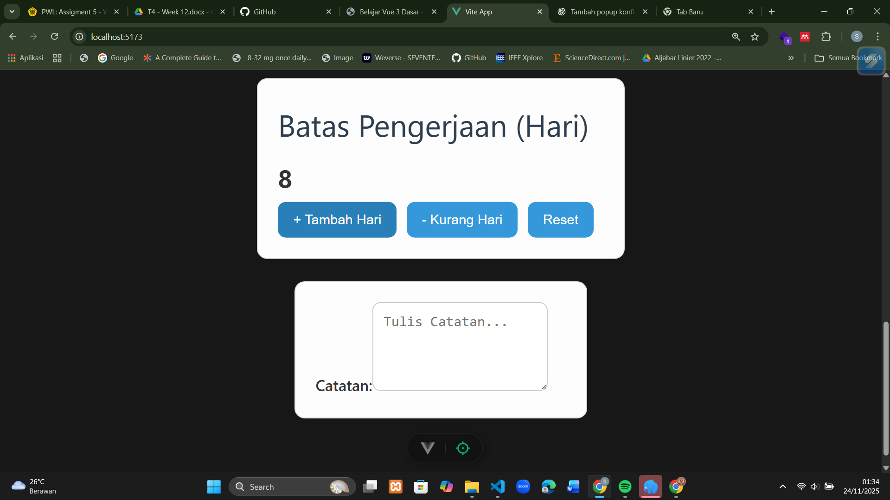
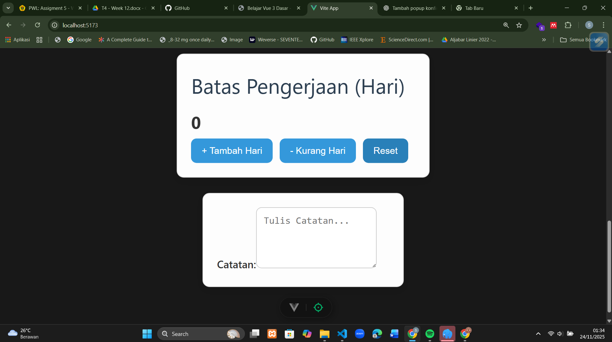
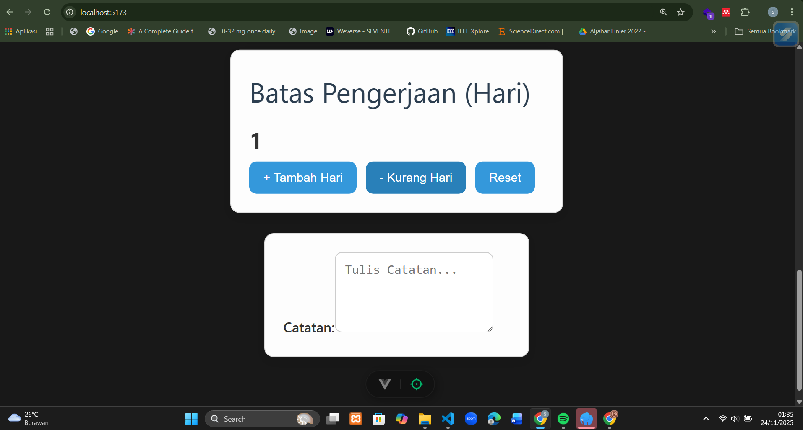
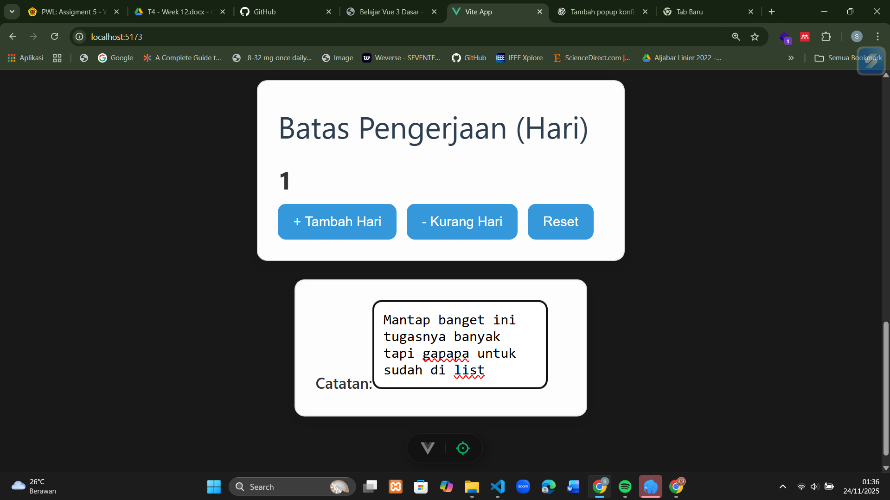

# Assignment: Vue.js – Simple To-Do List
## Identitas
- Nama : Nurul Qalbi Zahrani
- NIM : F1D022150
---
## Deskripsi Tugas
Pada tugas ini saya membuat aplikasi To-Do List sederhana menggunakan Vue.js.
Aplikasi memiliki fitur:
- Menambah tugas
- Menghapus tugas
- Menampilkan pesan saat daftar kosong
- Menggunakan reaktifitas dengan `ref()`
---
## Hasil
### 1. Screenshot Hasil Program

### 2. Penjelasan Singkat
Jelaskan bagian penting, misalnya:
- bagaimana `addTask()` bekerja
- bagaimana data ditampilkan menggunakan `v-for`

- cara kerja tombol hapus